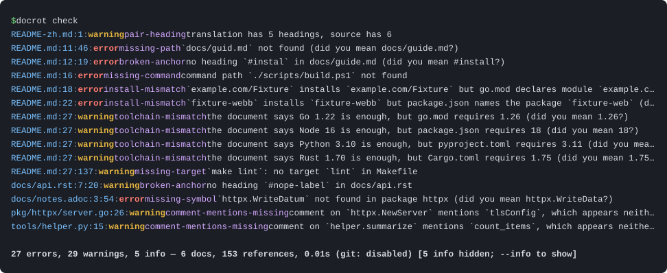
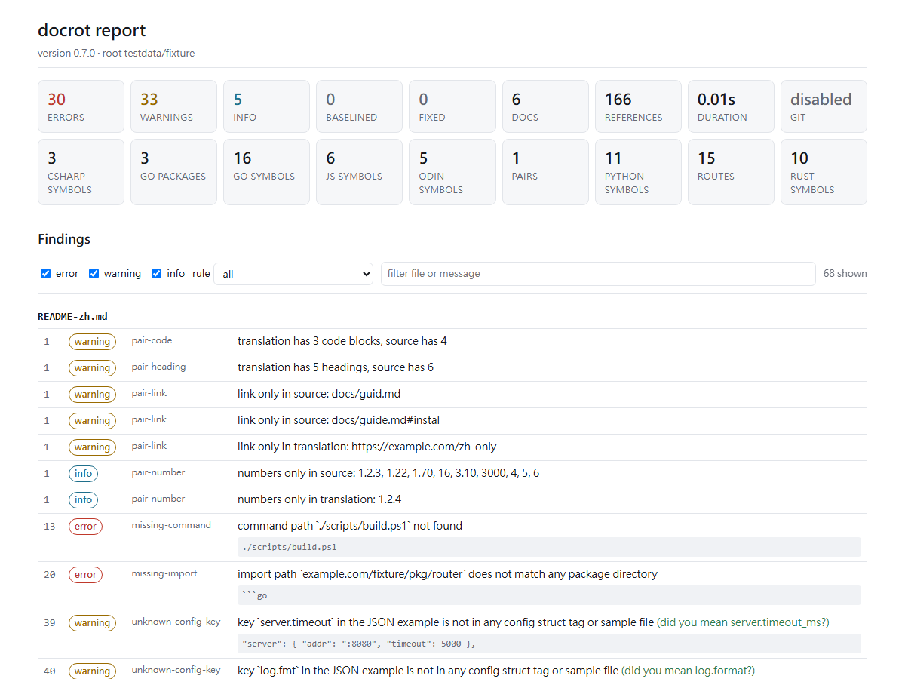

# docrot

**繁體中文** · [English](README.md)

**docrot 找出「文件在說謊」的地方。**

- README 裡那個函式，上個 sprint 是不是已經改名了？
- `llms.txt` 指給 AI agent 的檔案，還在嗎？
- 快速上手裡的 `--config` flag，是不是早就刪了？
- 指南裡的錨點還指得到嗎？中文 README 落後英文版幾個 commit 了？

沒有人知道——連結檢查器只看 URL，Markdown linter 只看排版，沒有工具檢查文件裡的「主張」。

docrot 就是做這件事的：

- 📌 抽出文件對 repo 的每一個主張（路徑、符號、flag、環境變數、設定鍵、路由、預設值、安裝指令），對照真正的程式碼
- ⏳ 用 git 歷史找出程式碼早已往前走的章節
- 🌏 盯著雙語文件是否同步
- 📦 讀 Markdown、reStructuredText、AsciiDoc，對照 Go、Python、TypeScript／JavaScript、Rust、C#、Odin 程式碼；單一靜態 Go 執行檔，**只用標準庫**；HTML 報告離線就能開



兩張圖都來自 `testdata/fixture` 這個故意種了錯誤的測試 repo。真實 repo 的結果——八個
Go／Odin repo、七個 Python 專案、三個 Rust crate、三個 JavaScript／TypeScript 專案、三個 C# 專案，
包括 FastAPI 的 1,692 份文件與 Django 的 686 頁 Sphinx 文件——見[實地報告](docs/field-report.md)。

## 🚀 安裝

```sh
go install ./cmd/docrot          # from a clone
go build -o docrot ./cmd/docrot  # or just build the binary
```

需要 Go 1.26+。`PATH` 上的 `git` 是選配；沒有 git 時，依賴 git 的規則會靜默停用。

## ⚡ 快速上手

```sh
cd your-repo
docrot check                    # text report, exit 1 on errors; .docrot/ gets html, md, json and txt
docrot check --changed          # only the documents you touched (pre-commit speed)
docrot explain README.md        # what did it extract, and why?
docrot coverage                 # which exported API is never documented?
docrot baseline                 # freeze today's findings; fail only on new ones
```

## 🔍 檢查什麼

- 📁 **路徑、符號、import** —— `` `internal/gitx/gitx.go` ``、`` `report.WriteSARIF` ``、
  `` `render_frame()` `` 與 `import "docrot/internal/model"` 都存在（Go 走 `go/parser`；
  Odin、Python、Rust、JavaScript／TypeScript 與 C# 走會跟著再匯出的宣告索引），附「你是不是想找」建議與 git 改名歷史。
- 🎛️ **flag、環境變數、設定鍵、預設值** —— `--format` 有定義、`DOCROT_DEBUG` 有被讀、
  `stale.minChurn` 是 struct tag 或樣本檔裡的鍵、```` ```json ```` 設定範例沒有已刪掉的鍵、
  「`--port` 預設是 `8080`」和程式碼說的一樣。
- 🌐 **HTTP 路由** —— `GET /v1/items` 真的有 handler 註冊（net/http、chi、gin、echo、
  FastAPI、Flask、Starlette、Django、axum、actix-web、rocket、express、fastify、hono、NestJS、ASP.NET Core）。
- 🔗 **錨點、指令、安裝行、工具鏈、目標** —— `[x](docs/rules.md#exit-codes)` 指得到、
  `python scripts/verify.py` 存在、`go get`／`pip install`／`cargo add`／`npm install`／`dotnet add package` 寫對本專案的名字、
  `import { x } from 'pkg/sub'` 指到真的子路徑、
  「requires Go 1.21」與 `go.mod` 一致、`make lint` 是真的目標。 <!-- docrot:ignore toolchain-mismatch -->
- ⏳ **過期判定（git）** —— 章節最後編輯之後，它引用的檔案或宣告仍持續變動。
- 🌏 **雙語配對** —— `README.md` ↔ `README-zh.md` 標題、程式碼區塊、連結、表格、數字
  一致，翻譯沒有落後原文。
- 💬 **程式碼註解** —— 被文件提到的符號，其 doc comment 提到的東西仍然存在，本體也沒有
  在註解寫完之後獨自往前走。
- 📊 **覆蓋率** —— 沒有任何文件提到的 exported 符號、flag 與環境變數。

每條規則怎麼判斷、怎麼消除：[docs/rules.md](docs/rules.md)。

## 🧠 怎麼判斷

把每份文件 tokenize，抽出帶*種類*與*信心值*的引用，整個 repo 只建一次索引（檔案、
Go／Odin／Python／Rust／JS／C# 宣告、路由、字串常值、manifest、錨點），逐一解析，用 blame 與 log 判斷
過期，比對配對指紋，檢查註解，套用 baseline。嚴重度跟著信心值走：high → error、
medium → warning、low → info；文字報告預設隱藏 info，加 `--info` 才列出。啟發式規則是在
真實 repo 上調校的；它刻意忽略哪些東西，寫在 [docs/how-it-works.md](docs/how-it-works.md)。

## ⚙️ 設定

`docrot init` 會寫出帶預設值的 `.docrot.json`。真正會動到的鍵：`docs` 與 `exclude`（掃什麼）、
`ignore`（套用在引用文字上的正規表示式）、`siblings`（路徑可能住在哪些其他 repo）、
`stale.exclude`（changelog 之類的歷史文件）、`severity` 與 `outDir`。要在原地壓掉一個誤報：

```markdown
<!-- docrot:ignore -->            the next non-blank line
inline text <!-- docrot:ignore -->  this line
<!-- docrot:ignore-start --> … <!-- docrot:ignore-end -->
<!-- docrot:ignore-file -->
<!-- docrot:ignore missing-path unknown-flag -->   only these rules (also with ignore-start)
```

每個鍵的預設值、輸出目錄與 git 快取：[docs/configuration.md](docs/configuration.md)。

## 🖥️ 指令

```text
docrot check [dir] [--format text|md|json|sarif|html] [--changed] [--since REF] [--fail-on LEVEL]
docrot explain <doc>             every extracted reference with its verdict
docrot baseline | coverage | pairs | comments | index | init | version
```

每次 `check` 都會把 HTML、Markdown、JSON 與文字報告寫進 `.docrot/`；HTML 版長這樣：



所有 flag、exit code 與 CI 範例：[docs/commands.md](docs/commands.md)。

## 🤖 CI

```yaml
- run: go run ./cmd/docrot check --format sarif --output docrot.sarif --fail-on error
- run: go run ./cmd/docrot check --changed --since origin/main --fail-on warning   # PR: changed docs only
- uses: github/codeql-action/upload-sarif@v3
  with: { sarif_file: docrot.sarif }
```

## 🛠️ 開發

```sh
python scripts/verify.py        # gofmt, vet, test, build, self-check, fixture check, formats
python scripts/demo.py ../some-repo --out reports
python scripts/screenshots.py   # regenerate docs/assets/ from the fixture
```

docrot 在 `scripts/verify.py` 裡會檢查自己的文件；`docs/superpowers/` 下有日期的設計文件在那裡被排除，
因為它們本來就充滿示意用的路徑。

## 📚 文件

- [規則](docs/rules.md)——每條規則怎麼判斷、怎麼消除
- [運作方式](docs/how-it-works.md)——處理流程、信心值與嚴重度、刻意忽略的東西
- [設定](docs/configuration.md)——`.docrot.json`、輸出目錄、git 快取
- [指令](docs/commands.md)——flag、exit code、CI
- [實地報告](docs/field-report.md)（Go 與 Odin）、[Python](docs/field-report-python.md)、[Rust](docs/field-report-rust.md)、[JavaScript／TypeScript](docs/field-report-js.md) 與 [C#](docs/field-report-csharp.md) 實地報告——在真實 repo 上找到什麼、哪些是噪音
- [變更紀錄](CHANGELOG.md) · [Roadmap](docs/roadmap.md) · [設計規格](docs/superpowers/specs/2026-09-23-docrot-design.md) · [計畫](docs/superpowers/plans/2026-09-23-docrot-plan.md) · 給 agent 的 [llms.txt](llms.txt)

## 🚫 非目標

- 不是 Markdown linter。排版不關 docrot 的事。
- 不是 CommonMark 實作。它只認得它需要的東西。
- 不執行範例，也不評斷翻譯品質。
- 不改寫文件（目前）。

## 📄 授權

MIT——見 [LICENSE](LICENSE)。
